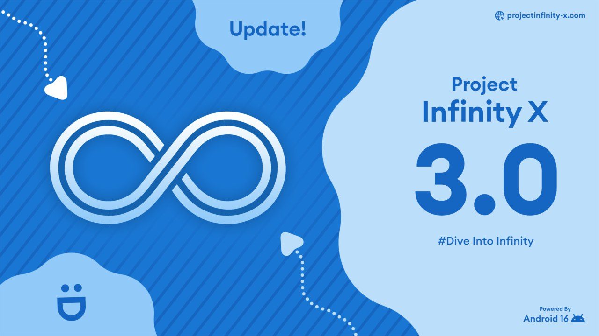

# Cyberdev's Xinfinty 3.0 Add-On Installer
This mods XInfinity with extra applications that the OS didn't install upon installation!

## What is this?
This mod allows you to mod XInfinity v3.x and adds additional new apps that the OS did not install, however this mod has limitations so please read this carefully so that you are aware of these limitations!

## Need the tweaks for XInfinty?..Please read!
If your looking for build.prop tweaks for XInfinity, we have converted the tweaks into a magisk module, you can download the magisk module from [here](url)

There is important information you must be aware of before using the the magisk module:

- This module is NOT compatible with APatch (we chose this because magisk is the most best and common root method and majority of modules support it more then apatch does!)
- This module requires you to be on magisk v20.4 or higher
- Your version of crDroid must match the version we have available, if you do not have the right version installed you will encounter issues
- The magisk module is not release date dependent its XIF Version dependent such at 3.x etc.
- When using this module you will lose the ability to install updates via OTA unless you disable the magisk module first, reboot and then perform the installation.

## Limitations:
This mod has limitations that require us to inform  you before using this mod these limitations are as follows:

-- We are not responsible if things go wrong such as an unexpected boot loop, system behavior or loss of files/damage to the firmware due to this mod, though we tested this on my personal device, it's clear with any kind of mod this is a risk always, We always encourage to backup any data before using this or any mod that alters your device(s) firmware.
- This mod will not trip/trigger existing Google Play Integrity verification that is the GREEN as some mods to build prop can trigger GPIV and lose verification, this mod does not trigger GPIUV and you will remain in the GREEN!

## What this mod will never install:
- This mod will NOT install applications that requires root, out goal is to keep our mod clean and use on unrooted devices, if you decide to root your device some included applications may cease to work due to root detection.

## What applications/Features does this mod installs?
The following applications/features are installed when you install this mod:

### Apps:
- Google Wallet
- Gmail
- Google VIPs STUB (Updatable via the Google Play Store)
- Google Play Protect Service STUB
- Google Find My Device
- Google Pixel Buds STUB (Updatable via the Google Play Store)
- Updater App shortcut
- YouTube

### Features:
- Pixel 9 Official Stock Bootanimation
- Fixed permissions for included applications etc.

## NOTICE:
When a new build is released the following things will revert back to stock until i release a updated version of this mod for that build so please be patient when that happens:
- Applications installed by this package
- Pixel 9 Official Stock bootanimation

## Installation:
To install you will need the following things:

- PC/Laptop
- Google OEM USB Drivers already installed, you do not have them you can download the drivers from [here](https://developer.android.com/studio/run/win-usb)
- XInfinity already installed; if you do not have XInfinity and need it you may lookup to see if your device is supported by going [here](https://projectinfinity-x.com/)
- Up-To-Date platform-tools for adb functionality (if you need the latest platform-tools you can download it from [here](https://technastic.com/android-sdk-platform-tools-download/)
- crDroids custom recovery.

## NOTICE FOR FIRST TIME INSTALLING & UPDATING INSTALLERS:
You will encounter an error when installing at the beginning such as metadata error etc, however this is normal and will continue to install the mod as normal, this occurs if the installer does not detect the library files for Google Play Protect Service, if it was present the errors would have not been displayed.

To install place the zip into your platform-tools folder and then open a terminal and type this, but before you do make sure you install this package after you flash you gapps package not before!:

Windows: `.\adb -d sideload filename.zip`

Other OS (if above fails): `adb -d sideload filename.zip`

If successful it will begin to run the installer, it will only take less than a minute to complete.

# TROUBLESHOOTING:

### Q: Google Play Store Stub has installed successfully, but doesn't show up via updates in the google play store, is there a way to update the app?

### Answer:
- If it doesn't show up in the play store you can download the update by visiting this [link](https://play.google.com/store/apps/details?id=com.google.android.odad) on your mobile device and choose to open via play store and the listing for GPPS listing will be displayed and you can update it from there.
